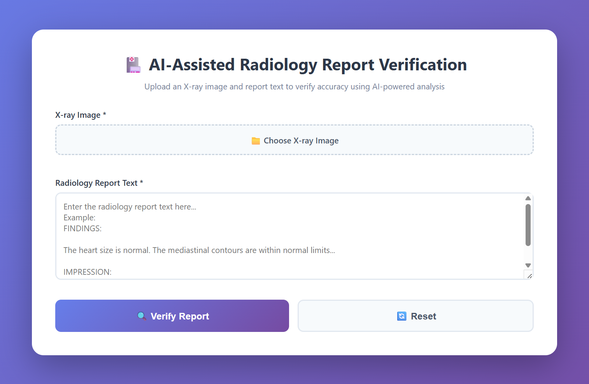
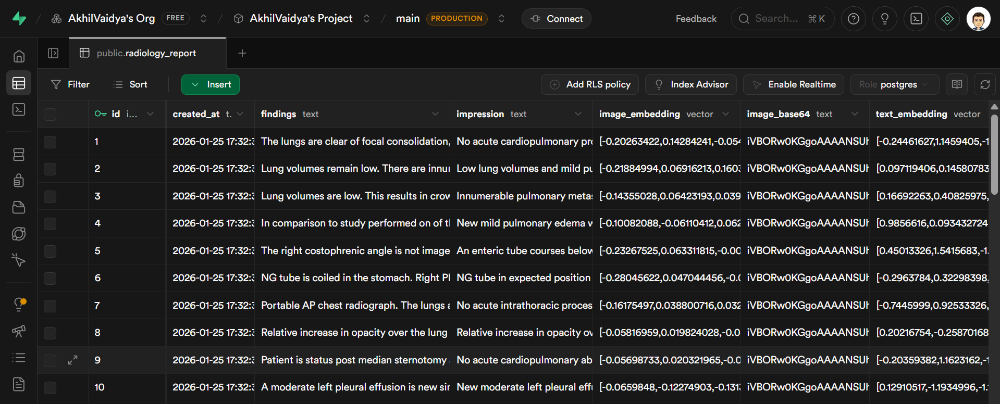
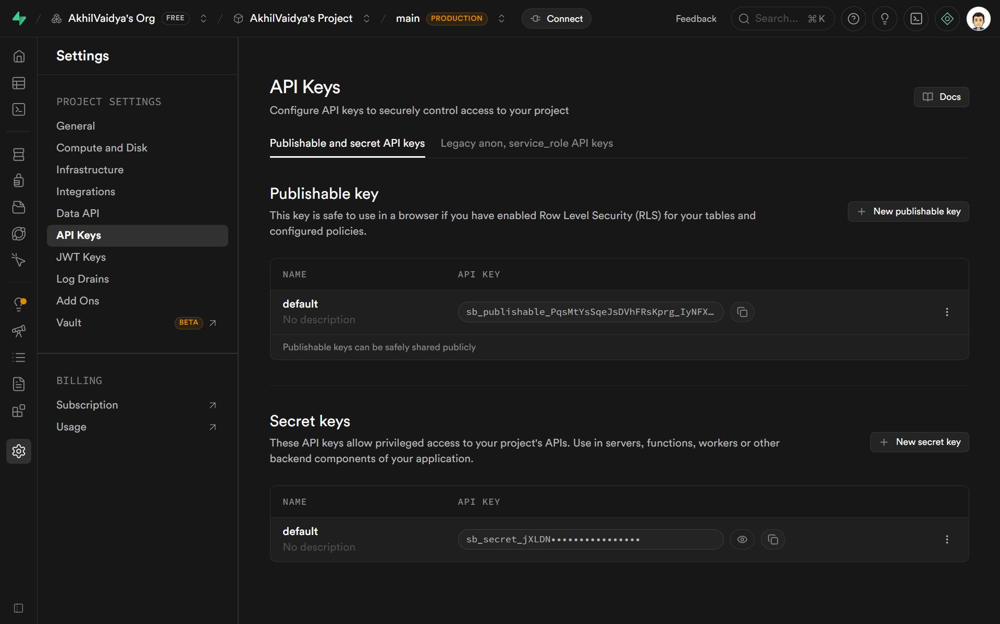
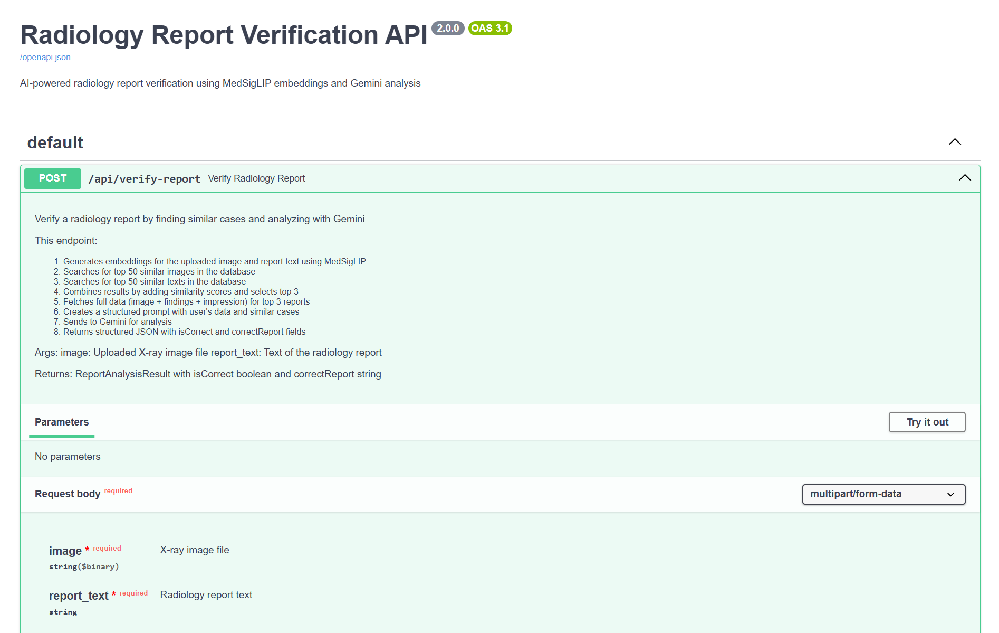
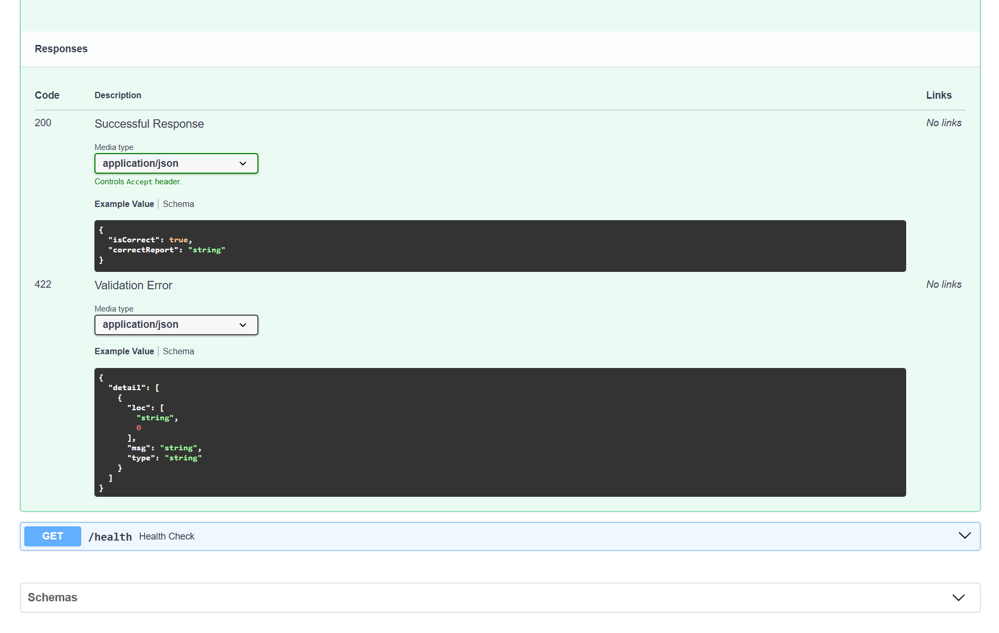

# MedRAG
An AI-assisted tool for radiology report validation : MedGemma & MedSigLIP

### Short problem context
- Radiologists need fast, reliable verification of X-ray findings and reports.
- Manually searching for similar cases and validating report completeness is slow and error-prone.
- MedRAG automates verification by matching uploaded X-rays and reports to similar cases, surfacing reference reports, and providing visual analysis.

### What this solution does
- Accepts an X-ray image and its radiology report, then returns:
	- AI-powered verification of report completeness and quality assurance.
	- Similar-case references with their associated reports.

	How it works : workflow
	- Upload: A radiologist uploads an X-ray image and the written radiology report.
	- Retrieve: The system computes both image and text embeddings for the upload, then queries the vector database (Supabase) to retrieve similar cases using both modalities.
	- Verify: Retrieved cases and their reports are aggregated and passed to an LLM-based verifier (ideally `MedGemma` served from an AWS SageMaker endpoint for production-quality clinical models). For this project, to reduce cost and enable reproducibility, the system currently uses `Gemini` for the verification and natural-language reasoning step.
	- Output: The service returns a verification summary (completeness checks, discrepancies, suggested edits) and similar-case references (with links to their reports).

### User flow
- Upload your X-ray image and the report text, then click verify.
- The app finds similar examples from a large medical dataset and checks whether your report is complete and consistent with those examples.
- It returns an easy-to-read summary and example reports you can review.

### Live app





- Deployed frontend URL: https://akhilvaidya91.github.io/MedRAG/
- Deployed backend API URL: https://akhil-vaidya-medrag-backend.hf.space/

### **Setup & Configuration : Overview**
This section walks through everything needed to reproduce and run the MedRAG backend and ETL pipeline locally or on hosted infrastructure.

**High-level steps**
1. Prepare data and embeddings (GPU recommended).
2. Create Supabase project and enable `pgvector` extension.
3. Load precomputed embeddings and metadata into Supabase using the ETL notebook.
4. Configure environment variables and run the FastAPI backend in `src/app.py`.
5. Use the frontend in `docs/` to interact or deploy frontend/backend to hosting providers.

**Data**
- Official dataset used: MIMIC-CXR
	- Link: https://physionet.org/content/mimic-cxr/2.1.0/
	- About: Chest X-ray images paired with radiology reports collected from clinical care. Contains images, associated DICOM metadata, and free-text radiology reports.
	- Size: Over thirty thousand image-report pairs.

**Data source used in pipeline**
- Hugging Face dataset (parquet formatted files): https://huggingface.co/datasets/itsanmolgupta/mimic-cxr-dataset
- Access via the `datasets` library to stream or download parquet files into the ETL pipeline.

**Embeddings**
- Model used: `google/medsiglip-448` (multimodal medical embedding model)
	- Link: https://huggingface.co/google/medsiglip-448
	- Purpose: Produces normalized vector embeddings for medical images and associated text. Supports multimodal (image + text) representations enabling robust retrieval across modalities.
	- Requirements: You must accept model terms on Hugging Face and provide an HF token (`HF_TOKEN`). Store `HF_TOKEN` in environment variables.

### Notes about embedding computation
- Embedding creation is computationally intensive and requires GPU for reasonable throughput.
- Example environment used: Kaggle P100 GPU instance (or equivalent NVIDIA GPU). CPU-only machines are not practical for full dataset embedding.

### ETL / Embedding pipeline
- The repository includes `notebooks/push_to_supabase.ipynb` which demonstrates fetching data, preprocessing, creating embeddings, and pushing them to Supabase.
- Steps in the notebook:
	1. Load dataset from Hugging Face / Parquet files.
	2. Preprocess images and text (resize/normalize images, clean reports).
	3. Call `medsiglip-448` to create image and text embeddings (normalize vectors).
	4. Upload metadata and embeddings to Supabase via its REST API or client.


### Database (Supabase) setup
- Database: Supabase (Postgres) with `pgvector` extension enabled for similarity search.
- Table structure:




- Before loading data, run the SQL functions in `notebooks/function_setup.sql` using the Supabase SQL Console. These functions implement inner-product based similarity search (mathematically identical to cosine similarity when embeddings are normalized but computationally faster):
	- `image_match(...)` - finds visually similar cases via image embeddings.
	- `text_match(...)` - finds textually similar cases via report embeddings.

### SQL details : similarity search and inner product
- Background: similarity search for embeddings commonly uses cosine similarity. When embeddings are normalized to unit length, cosine similarity and the inner (dot) product are mathematically equivalent.
- Why inner product: inner-product computations are often faster and more straightforward to index in vector-enabled databases. With normalized vectors, ranking by inner product equals ranking by cosine similarity : this provides identical retrieval results but with performance benefits.
- Implementation note: `function_setup.sql` creates helper functions that compute inner-product based scores and return top-k matches together with distances, making retrievals efficient for both image and text queries.

- Where to get keys:
	- In the Supabase project, go to Project Settings → API Keys.
	- Use the `anon`/publishable key and the `service_role`/secret key depending on use-case. For the deployed backend this project uses the API key approach : store values as environment variables `SUPABASE_URL` and `SUPABASE_KEY`.
	- For the ETL notebook you can use the full connection string during data push if preferred.




### Environment variables
Set the following environment variables before running the backend or ETL steps (example names preserved):

| Variable | Purpose |
|---|---|
| `HF_TOKEN` | Hugging Face token (for `medsiglip-448`). Must accept model terms. |
| `SUPABASE_URL` | Supabase project REST URL (from project settings). |
| `SUPABASE_KEY` | Supabase API key (Publishable or service role depending on operation). |
| `GEMINI_API_KEY` | API key for Gemini (AI inference). Generate at https://aistudio.google.com/app/api-keys |

### Running the ETL / data push
1. Launch a GPU-enabled environment (Kaggle, Colab Pro, or cloud GPU instance).
2. Install dependencies (prefer using a virtualenv or Conda):

```bash
pip install -r requirements.txt
```

3. Open and run `notebooks/push_to_supabase.ipynb` top-to-bottom. Ensure `HF_TOKEN` and Supabase credentials are set in the notebook environment (or provided via environment variables).

### Running the backend (local)
1. Install Python dependencies:

```bash
pip install -r requirements.txt
```

2. Ensure required environment variables are set in your shell or `.env`:

```bash
setx HF_TOKEN "<your_hf_token>"
setx SUPABASE_URL "<your_supabase_url>"
setx SUPABASE_KEY "<your_supabase_key>"
setx GEMINI_API_KEY "<your_gemini_key>"
```

3. Start the backend:

```bash
python src/app.py
```

4. API docs (FastAPI) are available at `http://localhost:8000/docs` when running locally. Use this to explore endpoints and test uploads.

### Frontend
- The static frontend is located in the `docs/` folder. It can be run locally by serving the folder (or opened directly if static HTML).
- For local execution, point the frontend to `http://localhost:8000` (or your backend host) in its configuration.
- Deployment options: Backend → Hugging Face Spaces or Cloud VM; Frontend → GitHub Pages (CI: GitHub Actions).

### Docker & deployment
- Docker is supported via the included `Dockerfile`. Use Docker to containerize the backend for consistent deployments across environments.
- Typical Docker workflow:

```bash
# build image
docker build -t medrag-backend .

# run (pass environment variables securely)
docker run -e HF_TOKEN="$HF_TOKEN" -e SUPABASE_URL="$SUPABASE_URL" -e SUPABASE_KEY="$SUPABASE_KEY" -e GEMINI_API_KEY="$GEMINI_API_KEY" -p 8000:8000 medrag-backend
```

- Hugging Face Spaces: You can deploy the backend to Hugging Face Spaces if the service fits their allowed patterns; serving static frontend on GitHub Pages is simpler. Docker makes either approach straightforward.

### API endpoints (summary)
| Endpoint | Method | Purpose |
|---|---:|---|
| `/api/verify-report` | POST | Primary endpoint: accepts X-ray image + text report, returns verification summary, similar-case references, and visual artifacts. |
| `/docs` | GET | FastAPI OpenAPI UI for interactive API exploration and testing. |
| `/health` | GET | Lightweight healthcheck endpoint for monitoring and readiness checks. |

Refer to the running FastAPI docs at `/docs` for exact request/response schemas and sample payloads.





### RAG (Retrieval-Augmented Generation) explanation
- MedRAG uses a retrieval layer (Supabase + vector search) to find nearest neighbors (image and text) for the uploaded case. Retrieved cases and reports are used as context for an LLM (Gemini or other model) which performs QA, verification, and explanation.
- Steps:
	1. Compute embedding for uploaded image and/or report.
	2. Query Supabase via `image_match` and `text_match` functions to find similar cases.
	3. Pass top-k results to LLM as context + the user's report for verification and suggested edits.

### Repository structure
| Path | Purpose |
|---|---|
| [src/app.py](src/app.py) | FastAPI backend entrypoint handling uploads and retrievals. |
| [notebooks/push_to_supabase.ipynb](notebooks/push_to_supabase.ipynb) | ETL notebook: downloads data, creates embeddings, and pushes to Supabase. |
| [notebooks/function_setup.sql](notebooks/function_setup.sql) | SQL functions for image/text similarity (run in Supabase SQL Console). |
| [docs/](docs/) | Frontend static site and assets. |
| requirements.txt | Python dependencies. |
| tests/test.py | Minimal test harness (unit tests start here). |

Refer to the running FastAPI docs at `/docs` for exact request/response schemas.